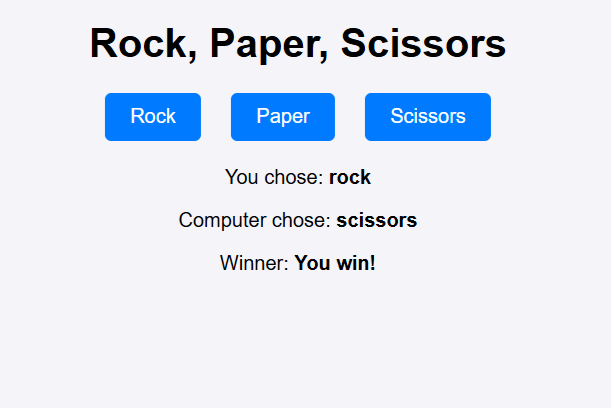

# Rock-Paper-Scissors Game

A simple Rock-Paper-Scissors game built using HTML, CSS, and JavaScript.

## Description
This project is a browser-based implementation of Rock-Paper-Scissors, allowing players to compete against a computer opponent. This project provides a fun and interactive way to play the classic game while demonstrating core JavaScript concepts and DOM manipulation.

## Screenshots
A preview of the game interface while playing:

## JavaScript Built-in Methods Used
- Math.random()
- Math.floor()
- addEventListener()
- querySelector()
- querySelectorAll()
- textContent

## License
This project is licensed under the MIT License. You are free to use, modify, and distribute this project with attribution. Feel free to use this for your own projects, homework, or just for fun! If you do, a little shout-out would be greatly appreciated. Sharing is caring! 😊 See the LICENSE file for more details.
